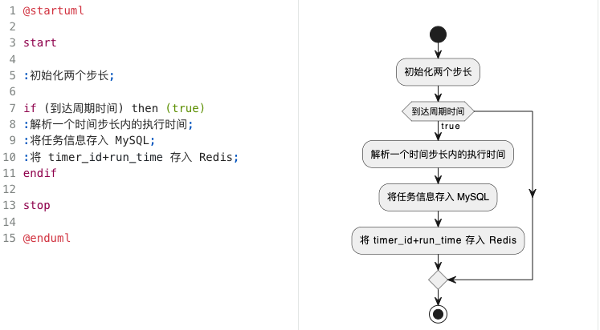
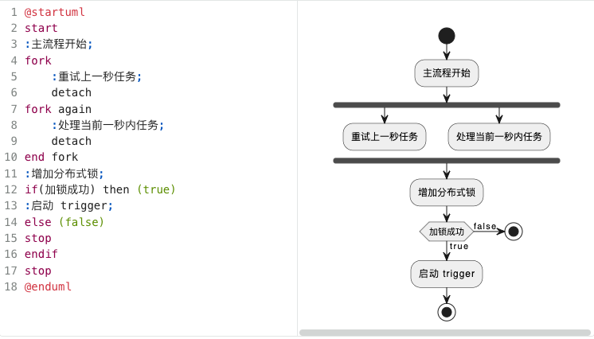
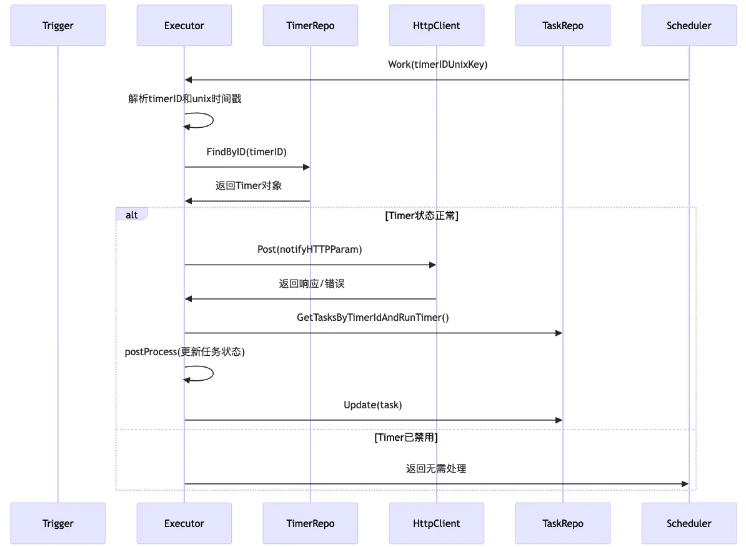

# Micor-tt

**项目说明：tick-tock项目是开源项目 xTimer 的复现版本**

原项目地址：

- GitHub: https://github.com/xiaoxuxiansheng/xtimer?tab=readme-ov-file
- 技术文档: https://juejin.cn/post/7174007780104208392#heading-22

一款依赖于 MySQL、Redis 组件，基于 Go 语言实现的分布式定时器。

## 服务模块

- tick-tock
- gateway
- user(auth)

## 表结构

```sql
-- 任务定义表
CREATE TABLE task_defines
(
    id                bigint AUTO_INCREMENT PRIMARY KEY,
    tid               varchar(36) NOT NULL COMMENT '任务唯一标识（UUID）',
    app               varchar(64) NOT NULL DEFAULT '' COMMENT '所属应用标识',
    name              varchar(32) NOT NULL DEFAULT '' COMMENT '任务名称',
    status            tinyint     NOT NULL DEFAULT 1 COMMENT '状态：1-active, 2-inactive',
    cron              varchar(64) NOT NULL COMMENT 'Cron表达式（标准5/6字段）',
    notify_http_param json NULL COMMENT '回调参数（JSON格式，如{"url":"","method":"POST","headers":{}}）',
    create_time       timestamp   NOT NULL DEFAULT CURRENT_TIMESTAMP,
    update_time       timestamp   NOT NULL DEFAULT CURRENT_TIMESTAMP ON UPDATE CURRENT_TIMESTAMP,
    UNIQUE KEY uk_task_defines_tid (tid)
) COMMENT '任务定义表';

--     任务表
create table task
(
    id          bigint auto_increment
primary key,
    app         varchar(64) default ''                not null,
    tid         varchar(36)                           not null,
    output      text                                  not null comment '执行结果',
    run_time    timestamp                             not null comment '执行时间',
    cost_time   bigint                                not null comment '执行耗时（毫秒）',
    status      tinyint                               not null comment '当前状态 未执行 0 执行中 1 执行成功 2 执行失败 3',
    create_time timestamp   default CURRENT_TIMESTAMP not null,
    update_time timestamp   default CURRENT_TIMESTAMP not null on update CURRENT_TIMESTAMP
);
```

## Migrator

- 将批量任务存入 Redis 时可以使用 pipeline 技术，减少频繁的网络传输带来的开销
- MySQL 中的数据用于兜底
  - 在查询 MySQL 时，需要过滤掉 bucket 之外的数据

## Scheduler


## Executor
